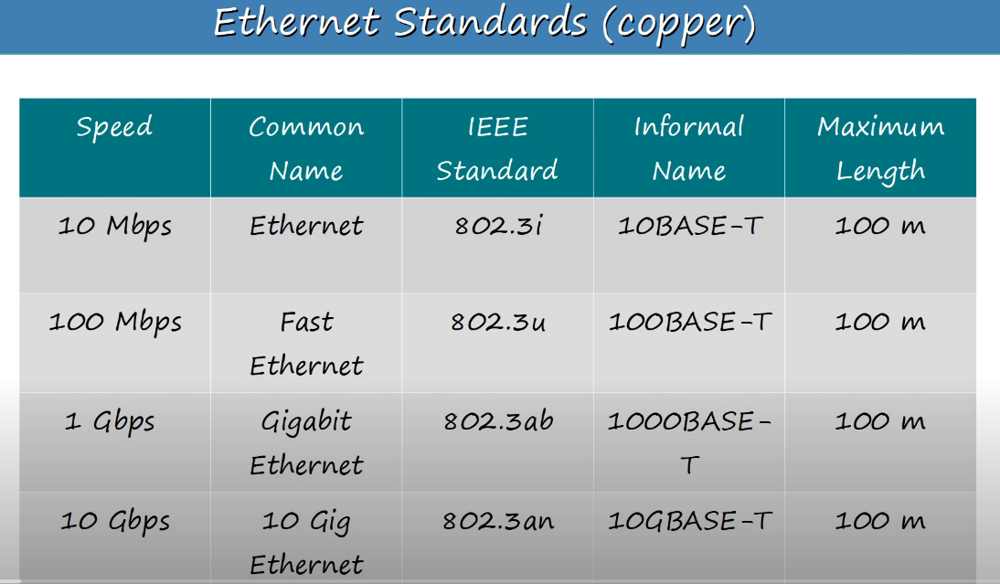

### 1. Packet tracer

### 2. Interfaces and Cables

- 10/100/100Base-T Ports
    - Base refers to baseband signalling
    - T = twisted pair

- RJ-45 (Registered Jack)

-  Ethernet
    - Ethernet is a a collection of network protocols/standards

- Bits and Byrtes

Ethernet standards
- Defined in the IEEE 802.3 standard in 1983

- UTP (Unshieled twisted pair) (protects against EMI)
- UTP cables (10 Base-T, 100 Base-T)

| Device Type  |  Tx Pins  |  Received (Rx) pins
|---|---| ---|
| Router  | 1 and 2   | 3 and 6
| Firewall  | 1 and 2   | 3 and 6
|PC   |1 and 2   |3 and 6
|Switch| 3 and 6 | 1 and 2

| UTP  |  Fiber-optic  |  
|---|---|
|Lower cost|Expensive|
|Shorter maximum distance than fiber-optic(~100m)|Longer distances than UTP|
|Vulnerable to EMI|Not Vulnerable|
|RJ45 ports are used with UTP are cheaper SFP ports|SFP ports are more expoensive than RJ45 ports(Single mode is more expensive than multimode)|
|Emit(leak) a faint signal outside of the cable, which can be copied(Security risk)|Does not emit any signal outside the cable|

Auto MDI-X mode
- Auto MDI-X allows devices to detect which pins and wires theior neighbor is using to transmit and receve data, and adjust their own operations to match.

- UTP would keeo the cist down, but does not support over 100 meters
- Single mode fiver supports distance much longer than 150 meters, it is more expensive than multimode fiber.
- Multimode fiber, supports over 150m and cheper than single mode but does support distances like 3 kilometers

                       
